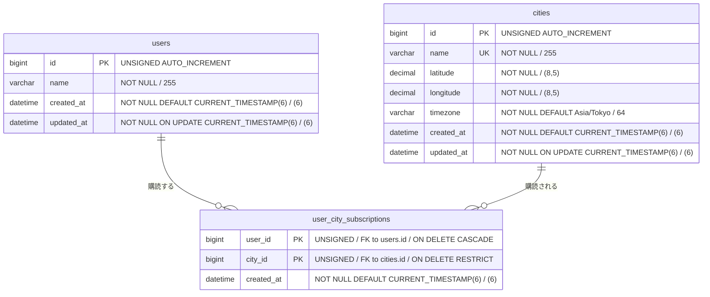

# heavy-weather DB スキーマ設計（初期段階）

天気通知システムのデータモデル。設計書 `heavy-weather-architecture.md` の不変条件を DB 側で表現したもの。

## この文書の範囲

**初期段階の目標は「各ユーザーが購読している都市の天気情報を Open-Meteo から取得できること」の実証。** 通知の送信・冪等性・バウンス処理はまだ扱わない。

したがってここに記すのは、その目標を満たす**最小限の3テーブル**のみ。通知系のテーブルは実証が済んでから追加する（末尾「今後追加するテーブル」参照）。

前提:

- **MySQL 8.4 LTS（8.4.10）/ InnoDB**（外部キー制約を使うため MyISAM は不可）
- 文字セットは `utf8mb4`、照合順序は `utf8mb4_0900_ai_ci`（8.4 の既定）
- **Geocoding API は使わない。** 都市の緯度経度・タイムゾーンは `cities` に手動登録する
- 天気予報データは永続化しない（取得して終わり）

## ER 図



## テーブルごとの役割

### `users`

ユーザーの identity のみを持つ。この段階では購読の主体を表すだけで、通知先の情報は持たない。

**メールアドレスをここに置かないこと。** 通知チャネルが増えるたびに列が生える構造になる。宛先は後から追加する `user_channels` に持たせる。

テーブル名は `users`（複数形）。MySQL 8.4 では `user` は予約語ではないため単数形でも動作するが、`USER()` 関数および `mysql.user` システムテーブルと紛らわしいため複数形を採る。

### `cities`

Geocoding を使わないため、緯度経度とタイムゾーンを手動登録する。

Open-Meteo の Forecast API は都市名を受け付けず、位置指定は `latitude` / `longitude` / `elevation` / `cell_selection` のみ。アプリケーションが持つべきは座標であり、都市名は人間が識別するためのラベルにすぎない。

`latitude` / `longitude` は `DECIMAL(8,5)`。整数部3桁・小数部5桁で経度 `-180.00000` まで表現でき、精度は約1m。浮動小数点型（`FLOAT` / `DOUBLE`）を使うと、後述の `UNIQUE (latitude, longitude)` が誤差で機能しなくなる。

### `user_city_subscriptions`

**「どの都市の予報を取るか」を決める。** 設計書の処理順序「ユーザー取得 → 都市の重複排除 → 予報取得」における重複排除の入力であり、初期段階の実証における中心。

```sql
SELECT DISTINCT city_id FROM user_city_subscriptions;
```

ユーザーが1万人でも購読都市が20都市なら、Open-Meteo への問い合わせは20地点分で済む。Open-Meteo は `latitude` / `longitude` をカンマ区切りで最大1,000地点まで1リクエストに載せられるため、実質1回の HTTP リクエストに収まる。

予報取得後は逆方向に引き直し、ユーザーごとの結果に紐付ける。

```sql
SELECT user_id, city_id FROM user_city_subscriptions;
-- → メモリ上の forecast[city_id] と突き合わせる
```

ユーザーと都市は多対多であり、`users` に `city_id` を1本持たせる形では表現できない。配列やカンマ区切り文字列で持つと DISTINCT・JOIN・外部キー制約がすべて効かなくなる。

## 制約・インデックス

| 対象 | 内容 | 理由 |
|---|---|---|
| `cities` | `UNIQUE KEY (latitude, longitude)` | 同一地点の二重登録防止。Geocoding を使わず手動登録するため、名前揺れで重複が生まれやすい |
| `cities` | `UNIQUE KEY (name)` | 都市名での識別を一意にする |
| `user_city_subscriptions` | `PRIMARY KEY (user_id, city_id)` | 同一ユーザーが同一都市を二重購読することを防ぐ |
| `user_city_subscriptions` | `KEY (city_id)` | 都市側から購読ユーザーを引く経路 |

`user_city_subscriptions.city_id` を `ON DELETE RESTRICT` にしているのは、購読者がいる都市をマスタから消せないようにするため。`user_id` 側は `CASCADE` で、ユーザー削除時に購読も消える。

### MySQL 固有の注意点

**`KEY (city_id)` は省略できない。** InnoDB の主キーはクラスタ化インデックスであり、`PRIMARY KEY (user_id, city_id)` は先頭列 `user_id` からしか辿れない。`city_id` 単独の検索・JOIN には別途セカンダリインデックスが要る。なお `city_id` には外部キーを張るため、InnoDB が自動でインデックスを作る（明示的に定義しておく方が意図が読める）。

**`VARCHAR` の長さは `UNIQUE` の可否に直結する。** MySQL の InnoDB では単一インデックスのキー長上限が 3072 バイトで、`utf8mb4` は1文字最大4バイトのため `VARCHAR(768)` を超える列にはプレフィックス長なしで `UNIQUE` を張れない。`cities.name` は `VARCHAR(255)` としているので問題ない。PostgreSQL の `TEXT` に相当する型をそのまま使うと、この制約に引っかかる。

**時刻型は `DATETIME(6)` を UTC 固定で使う。** `TIMESTAMP` はセッションのタイムゾーンに応じて自動変換される一方、2038年問題を抱える。`DATETIME` はタイムゾーンを持たないため、アプリケーション側で UTC に統一して読み書きする規約が必要になる。Lambda の実行環境は既定で UTC なので、Go 側は `time.Time` を UTC のまま渡す。

**部分インデックスは使えない。** PostgreSQL の `INDEX (user_id) WHERE enabled` に相当する構文が MySQL にない。将来 `user_channels` を追加する際、有効チャネルの絞り込みには `KEY (user_id, enabled)` のような複合インデックスで代替する。

## 天気予報データを保存しない理由

予報データは「取得 → イベントの `payload` に載せる → 送信側で整形」の流れを通過するだけで、永続化が処理の前提になっていない。DB に入れても読み手がいない。

加えて予報は「同じ都市・同じ日付」に対して実行のたび更新される時系列データであり、素朴に1テーブルへ入れると主キー設計（取得時刻を含めるか、上書きするか）の判断が必要になる。第1段階のドメインロジックとは無関係なコストが発生する。

後から「予報が外れた／通知内容がおかしい」を追跡したくなった場合は、`forecast_snapshots`（`city_id` + `target_date` + `fetched_at` を複合主キーとし、Open-Meteo のレスポンスを `JSON` 型の一列でそのまま保存）を追加する。正規化して列に展開すると API のスキーマ変更のたびにマイグレーションが要る。

## 今後追加するテーブル

初期段階の実証には不要。設計書 §9 の該当段階で追加する。

| テーブル | 追加時期 | 目的 |
|---|---|---|
| `user_channels` | 通知の送信を組み込む時点 | チャネル選択は発行側の責務。`(user × 有効チャネル)` の展開と、バウンス時のチャネル単位の無効化 |
| `user_notification_settings` | 同上 | 降水確率の閾値・通知時刻。それまではハードコードでよい |
| `notification_deliveries` | 第5段階（異常系） | 冪等性チェック |
| `ses_suppressions` | 第5段階（異常系） | バウンス・苦情の記録 |

`notification_deliveries` の冪等性挿入は MySQL では以下の形になる。

```sql
INSERT INTO notification_deliveries (notification_id, channel, ...)
VALUES (?, ?, ...)
ON DUPLICATE KEY UPDATE notification_id = notification_id;
```

自己代入で「何もしない」を表現し、`RowsAffected() == 1` を挿入成功の判定に使う（重複時は 0）。`INSERT IGNORE` は NOT NULL 違反やデータ切り詰めまで警告に格下げして黙って通すため使わない。

## 未決定事項

### `notification_id` の生成規則

初期段階では使わないが、**第1段階のドメインロジックを書く前に確定させる必要がある**。後から変えると `notification_deliveries` の既存レコードと整合が取れない。

設計書は `hash(userId, date, type)` と記しているが、1ユーザーが複数都市を購読する場合、都市ごとに別の通知になるなら `cityId` を含める必要がある。含めないと同一ユーザーの東京分と大阪分が同じ `notification_id` になり、冪等性チェックで片方が「送信済み」と判定されて消える。

| 通知の単位 | `notification_id` |
|---|---|
| 都市ごとに1通 | `hash(userId, cityId, date, type)` |
| 購読都市をまとめて1通 | `hash(userId, date, type)`。対象都市はイベント `payload` 側の配列 |

### ユーザー管理の形態

設計書 §11 の未確認事項「社内ツール型（管理者が他人の設定を管理）かセルフサービス型か」が未決。Cognito と `users` の関係、都市の登録フローの主体に影響する。

ただしどちらであっても、都市の登録時に一度だけ名前解決し以後は座標を正とする構造は共通して使える。将来 Geocoding API を導入する場合に備え、`cities` に Geocoding の `id` を保存する列を足しておくと都市マスタの同一性を追跡できる。
